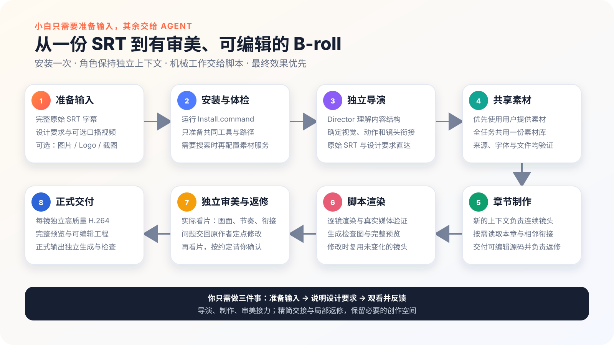

<div align="center">

# Erduo B-roll Loop Engineering

**把完整 original SRT 與 design 交給獨立 Director、fresh 章節 Creator、Parent 渲染與獨立審美 Reviewer，經原 Creator 局部返修後交付可編輯 B-roll。**

[简体中文](README.md) · [English](README.en.md) · [日本語](README.ja.md) · [한국어](README.ko.md) · **繁體中文**

[真實成片](#真實成片示範) · [安裝](#安裝) · [第一次使用](#第一次使用) · [已驗證範圍](#已驗證範圍)

</div>

## 真實成片示範

<p align="center">
  
</p>

README 中的輕量 GIF 代表一段 40 秒、3840 × 2160、30 fps 的完整 Master。它展示真實視覺能力，不保證所有輸入都得到相同畫面，也不表示 HyperFrames 與 Remotion 視覺一致。

## 它能做什麼

- 把完整 original SRT/design 保留在同一 project，依語意、時間與連續性設計 shot。
- 獨立 Director 決定 visual world 與接縫；fresh Creator 只收到原本、精簡共用方向、負責的 shot card 與相鄰 seam，製作連續段落。
- Parent 統一執行 plan check、逐鏡 render/decode、sheet 與 preview 組裝，局部修改後重用未變的本機結果。
- 另一名視覺 Reviewer 查看實際畫面與動態承接，具體問題交回原 Creator。
- v1.1.0 預設流程不再固定三類 sample、5-shot canary、每章 shot 數、素材或裝飾數量。

## v1.1.0：畫面品質優先的創作接力

新工作預設走 **獨立 Director → fresh 連續章節 Creator → Parent script → 獨立視覺 Reviewer → 原 Creator 局部返修**。創作角色保留完整原本與必要脈絡，各 task file 不把 Parent 全部對話、無關 Skill、Creator 解釋與 cost 帶進每一次判斷。

Parent 依[製作命令](erduo-broll-loop-engineering/references/lean-production.md)負責 render、驗證、組裝與本機重用。Creator 自查後，獨立 Reviewer 再看實際 media；contact sheet 不能代替連續播放，技術成功也不能批准審美。只有 style 不確定或共享 transition 複雜時，才先做代表段落觀看。

局部 rerender 與重用已驗證，但**尚未證明整體時間或 Token 減少**。task 準備工具不能刪除 host 注入的所有 instruction，也不強制 sandbox。Recipe/runtime-plan v1–v4、明確 Remotion/hybrid 或明確 5-shot 版本比較繼續走[相容 production](erduo-broll-loop-engineering/references/legacy-production.md)。

## v1.0.1：恢復 Chapter Builder 創作閉環

v1.0.1 已正式發布。語義 shot 仍是一鏡一份獨立 H.264 的媒體邊界，但一名 Chapter Builder 現在負責通常 5–8 個連續 shot。它直接閱讀完整 original SRT/design，不可修改 `truth`，可用一句理由修改 `creativeProposal`，並負責整章構圖、素材、節奏與承接。

Assets 只凍結已知共享素材/字型，不關閉逐鏡 `search`、`generate` 或 `mixed`。Lead 必須製作 native graphic/type、真實或生成素材 fusion、資訊密集 interface/process/data 三類最終 sample，以及 signature motion、素材融合能力與短 capability index。Builder 必須打開實際 6 格圖與 chapter preview，修復缺陷後回傳 `accepted` 或 `revised`。

production source 移除 `inspection.tsx`、DOM trace marker、人工 motion window 與通過態 dense diagnostics。Parent 只處理 render/decode/hash/contract/sheet/preview 的確定性工作。十二原則是精簡的正向 anchor，每鏡只選相關的 2–4 個 `craftIntent`，不評分也不造 proof。

production 預設使用 HyperFrames；Remotion 只限明確 opt-in/canary，`auto` 是實驗性 opt-in。5-shot canary 必須通過 direct delivery、Builder 真實看片、構圖/素材/signature motion 多樣性、使用者至少選擇我方 3/5，以及首版 preview ≤45 分鐘，才能開始全片。

2026-08-18 的 179.866 秒 Remotion run 保留為失敗證據：20/20 media contract/decode 雖通過，但產生 20 creative units、original design 未直達、素材不足，技術 inspection 通過也沒有帶來合格視覺。203m13s / 54m17s / 63m13s 同樣未達目標，不能證明本次修正或 backend 等價。

## v1.0.0 批量製作前先鎖定視覺

- Director 的完整語義鏡頭通常約 5–12 秒。Runtime Plan v3 分開規劃短鏡頭與 Builder unit；普通約 180 秒單 backend 以 2–3 個 Builder 為目標，但不是強制數量。
- Lead Builder 先完成 opening、資訊密集段與後段代表場景，以及每個實際 backend 可直接匯入的共享視覺 source。使用者批准、要求返修或明確 skip 後，其餘 Builder 才展開。
- 普通單 backend unit 預設高品質 H.264 MP4（`libx264 / medium / CRF 12`）。FFV1 只在 Hybrid、透明或真實 lossless 交換需要時，寫明理由後明確升級。
- motion/layout 先檢查 beat 邊界、readable hold、cut 與必要 sampling；只有異常區間和精密 diagram/path 才升級 dense trace，通過時不產生全片 frame PNG。
- 公開安全 production metrics 記錄階段耗時、Agent 呼叫、unit、檔案/byte、render/trace/decode/hash、失敗/重試與可選 host token 事實；沒有可靠 token 時明確標示 unknown，不從私人 session 推算。

[v1.0.0 公開 production benchmark](docs/V1.0.0-BENCHMARK.md)已用同一份 179.866 秒 SRT 完成一次 Codex 真實製作：20 份 Shot Recipe v3、1 名 Lead + 3 名 production Builder、10 次 Agent 呼叫、0 次 full-history 呼叫、0 件外部素材、213 個檔案，disk usage 為 156,980 KiB；preview 與 Master 都通過 full decode。Director 開始到首次 preview 約 242.05 分鐘，未達 120 分鐘目標；Lead 為 62.90 分鐘，也未達 45 分鐘目標。Director 的一次 visual-lock 拒絕在定點返修後通過複查，但使用者沒有觀看或作審美批准，因此狀態為 `skipped`。host token 為 unknown、音畫同步未測，Claude Code 同輸入比較仍為 pending。

## v0.9.2 創作能力不變，安裝路徑更清楚

v0.9.2 只調整發行格式與安裝入口。Director、Assets、多 Builder、152 張鏡頭卡、8 種圖解 grammar、執行環境路由、預覽審批與交付標準都與 v0.9.1 相同。

## v0.9.1 Creative Production 與更容易理解的圖解

- 保留 Director、Assets 與多名專責 Builder 的創作分工，不把動畫縮成固定模板，也不限制構圖、隱喻或動作複雜度。
- 後端規劃、任務分配、檢查、片段拼接與 preview 準備改由 Parent 直接執行確定性 script，不再啟動 Runtime Planner / Integrator / Render Agent；同一製作共用素材與相同依賴，不重複複製完整 project。
- 每名 Builder 交付可編輯 source 與統一規格、已驗證的 video clip。script 只拼接 clip，不宣稱能理解或合併任意 HyperFrames / Remotion source。
- 完整 preview 最高 1080p，使用 `veryfast / CRF 22` 產生。批准 identity 綁定 runtime plan、narrative envelope、visual system、全部 shot contract 與實際 clip hash。
- 交付時必須重新提供 `--plan`、`--narrative-envelope`、`--visual-system` 和全部 `--contract`。script 重新核對 identity，從凍結 clip 產生完整規格的 `medium / CRF 16` Master，絕不複製 preview 當成片。
- 把口播意義與情緒推進轉成 animation beat。Builder 必須讓主體、空間、層級、關係或視覺焦點產生可見發展；裝飾 loop 不能代替主要動畫。
- 只有在口播必須解釋流程、因果、時間順序、層級、feedback、依賴、system route 或同一標準比較時，Director 才按需從 8 種輕量 diagram grammar 選擇一種；沒有使用數量要求，不載入外部完整 Skill，也不套用固定 visual skin。
- Builder 仍依全片 visual system 自由設計空間、材質與動畫。script 只根據實際 render geometry 檢查 connector 穿過無關 node、label 接觸 path/node、connector path 重疊與超出 canvas，不評分圖解 style。
- 返工只回到原責任 Builder，不把完整製作歷史交給每一名 Builder。

檢查可以找出計畫未落地和可測量的 motion/layout 風險，但不能判斷動畫是否高級或代替使用者作審美決定；visual lock 管批量製作，完整動態 preview 管正式交付。本版不承諾雙後端視覺一致。

<p align="center">
  
</p>

## 安裝

### 標準 Skill 安裝

適合已經準備好固定 HyperFrames 環境的電腦。從 [v1.1.0 Release](https://github.com/erduo1998-cell/erduo-broll-loop-engineering/releases/tag/v1.1.0) 下載 `erduo-broll-loop-engineering-skills-v1.1.0.tar.gz`，解壓到長期保留的目錄後執行：

```bash
npx -y skills@1.5.22 add ./erduo-broll-loop-engineering-skills-1.1.0 --skill '*' --agent codex --global --full-depth
# Claude Code 請把 codex 改成 claude-code
```

這條路徑只註冊 14 個專案 Skill，不會準備 Node、瀏覽器或 FFmpeg。必要環境缺失時會停止，請改用下面的完整環境安裝。

### 完整環境安裝

需要：macOS、Node.js 22.20 或以上、FFmpeg/FFprobe，以及 Codex 或 Claude Code。

```bash
git clone https://github.com/erduo1998-cell/erduo-broll-loop-engineering.git
cd erduo-broll-loop-engineering
./Install.command
```

安裝後重新啟動宿主。安裝器會配置鎖定版本的 HyperFrames 環境與專案 Skill，不會使用 `sudo`、修改 shell 設定或全域安裝 Remotion。完整 archive 是 v1.1.0 Release 的 `erduo-broll-loop-engineering-v1.1.0.tar.gz`，解壓後仍執行 `./Install.command`。

診斷執行 `node scripts/doctor.mjs`；移除專案 Skill link 執行 `node scripts/uninstall.mjs`，預設保留 user data。maintainer 可用 `npm run task:creative -- --project /path/to/project --role director` 準備 focused task。

## 第一次使用

附上完整的 original SRT 與 design，然後輸入：

```text
使用 erduo-broll-loop-engineering，把這份 original SRT 與 design 做成可編輯的無人出鏡 B-roll shot 檔案與完整 preview；只有我明確要求時才產生整條 Master。
保留完整原本，使用獨立 Director、fresh 連續章節 Creator、Parent render 與獨立視覺 review。可見問題交回原 Creator 局部返修，最後交付有序 shot、可編輯 source/assets 與完整 preview。
```

口播模式還需要與字幕匹配的已剪輯影片。若有圖片、影片、Logo 或螢幕截圖，請在開始時一併提供。

## 語言支援

UTF-8 SRT 輸入不限定中文。實際語言品質取決於宿主模型對該語種的理解，以及專案字型是否覆蓋所需字形。預設 B-roll Master 不會燒錄整段字幕。

## 已驗證範圍

- macOS Codex 已確認 v1.1.0 的獨立 direction、creation、review、真實 decode、preview 組裝與局部 rerender 重用。Claude Code 的安裝/契約已驗證，但現行流程的同輸入比較仍 pending。
- v1.1.0 新工作預設使用固定 HyperFrames，交付有序 shot、可編輯 HTML/assets、完整 preview、真實輸出事實與限制；draft 與 final 分開。
- 歷史版本 v1.0.1 的同輸入 5-shot HyperFrames canary 已通過直接 render、full decode、觀看 receipt、構圖、素材與 signature motion gate。使用者認可結果，並明確要求不製作剩餘 shot 與完整 preview，直接公開。因此不宣稱全片 production 或兩個 backend 已同等驗證。
- v1.0.0 歷史 benchmark 使用 179.866 秒輸入，首次 preview 約 242.05 分鐘；v1.0.1 canary 後，剩餘長片由使用者取消。這些不能證明 v1.1.0 整體時間或 Token 降低。
- 既有 Remotion/hybrid project 使用 v1.0.1 相容 route。HyperFrames 與 Remotion 是獨立 backend，不承諾視覺一致。
- Windows、桌面版 CapCut/Jianying 匯入，以及任意現有專案的自動修復尚未驗證。
- 完整技術契約與疑難排解請見[簡體中文 README](README.md)。

## 工作流程

<p align="center">
  
</p>

## 聯絡作者

<table>
  <tr>
    <td width="260" align="center">
      
    </td>
    <td>
      <strong>刘冉 / 耳朵</strong><br><br>
      AI 諮詢顧問 · 前影視導演 · 開源 Agent 工具實踐者<br><br>
      GitHub：<a href="https://github.com/erduo1998-cell">@erduo1998-cell</a><br>
      首頁：<a href="https://erduo.art">erduo.art</a><br>
      微信：掃描左側二維碼
    </td>
  </tr>
</table>

授權：[MIT](LICENSE) · 支援細節：[SUPPORT-MATRIX.md](SUPPORT-MATRIX.md) · 貢獻：[CONTRIBUTING.md](CONTRIBUTING.md)
